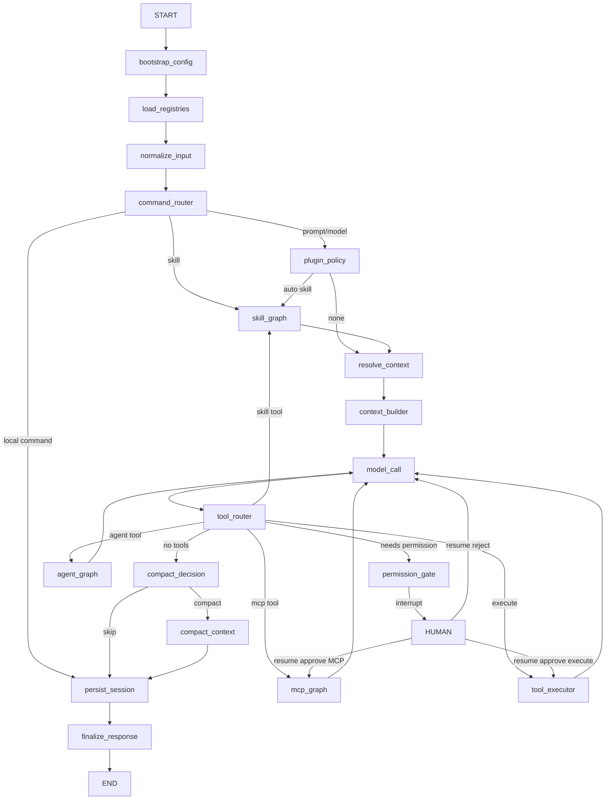

# Graph Architecture

## Main Graph

The runtime core is `langgraph_agent_blueprint.graph.builder.build_main_graph`. CLI and API adapters both call `AssistantGraphRuntime`, which invokes the same compiled LangGraph graph.



## State Schema

`AssistantState` is a TypedDict with LangGraph `add_messages` annotation for `messages`. It stores session ids, input, messages, registries, pending tool calls, permission state, plan mode, todos, memory, usage, MCP/plugin/hooks state, context references/attachments, child runs, artifacts, exports, errors, UI events, final response, and metadata.

Large tool outputs are intended to be stored by reference in storage, not kept unbounded in state.

Boundary data is validated with Pydantic before nodes act on it. State stores JSON-safe dicts for `ToolCall`, `ToolResult`, `RuntimeEvent`, command results, permission requests/decisions, and session records so checkpointing remains serializable.

## Nodes

- `bootstrap_config`: resolves config, permissions, project root, session metadata.
- `load_registries`: loads tools, commands, skills, hooks, MCP, plugin state, and runs `session_start` hooks once for a session.
- `normalize_input`: converts user input into messages, extracts conservative `@` context references, preserves API attachments, and runs `user_prompt` hooks.
- `command_router`: routes slash commands to local response, prompt, skill, or session behavior.
- `plugin_policy`: applies enabled plugin runtime policies before the first model response. Superpowers uses this to activate `superpowers/brainstorming` for obvious development prompts.
- `skill_router`: resolves active skill, renders prompt, narrows allowed tools, and runs `pre_skill` / `post_skill` hooks.
- `resolve_context`: resolves typed context references and attachments through provider services, applies the context budget, emits context events, and stores JSON-safe context metadata.
- `context_builder`: runs `pre_context_build` / `post_context_build` hooks and builds system context from project, memory, resolved context fragments, plugin bootstrap fragments, hook context fragments, tools, skills, todos.
- `model_call`: runs `pre_model` / `post_model` hooks, calls provider, and emits model/tool events.
- `tool_router`: runs `pre_tool`, classifies tool calls, runs `permission_request` hooks when approval is needed, and chooses execution, permission, skill, agent, MCP, or error route.
- `permission_gate`: uses LangGraph `interrupt`, resumes from approval/rejection, routes approved calls back to the intended execute or MCP route, and runs `permission_resolved` hooks.
- `tool_executor`: executes tools through `ToolExecutionService`, emits MCP-specific tool events for MCP adapters, and runs `post_tool` hooks.
- `agent_graph`: validates `SubagentRequest`, forks isolated child state, runs a child compiled main graph, persists child-run metadata/result, forwards subagent events, and returns a parent `ToolMessage`.
- `hook_runner`: compatibility node retained for graph shape; lifecycle hooks are dispatched by the graph nodes that own each lifecycle point.
- `compact_decision`: decides manual/automatic compaction.
- `compact_context`: runs `pre_compact` / `post_compact`, summarizes older context, and preserves recent work.
- `persist_session`: writes metadata, events, messages, todos, memory refs, tool calls.
- `finalize_response`: emits final response event.
- `error_recovery`: runs `error` hooks and turns recoverable errors into user-visible output.

## Subgraphs

Implemented subgraph builders:

- `command_graph`
- `skill_graph`
- `tool_execution_graph`
- `agent_graph`
- `mcp_graph`
- `session_lifecycle_graph`
- `plan_todo_graph`
- `memory_graph`
- `compaction_graph`

`agent_graph` is no longer a synthetic child-result placeholder. It executes a child graph with separate session/thread ids, narrowed allowed tools, parent/child metadata, and controlled result merge back into the parent tool-message loop. Nested side-effect approvals are guarded: child write/shell/network/MCP calls do not bypass `PermissionService`; unsupported nested approval returns a structured subagent error.

## Context Providers

Context resolution is graph-owned. `normalize_input` parses `@README.md`, `@src/`, `@glob:...`, `@notebook:...`, `@mcp:server:uri`, `@url:...`, and quoted path references into `ContextReference` records. `resolve_context` delegates to `ContextProviderService` and `ContextBudgetService`; `context_builder` only consumes rendered, marked, budgeted fragments.

Providers cover local files, directories, glob summaries, notebooks, MCP resources, URL context through `WebService`, text attachments, and metadata-only image/PDF placeholders. External, MCP, plugin, and pasted context is explicitly marked as data and untrusted prompt content.

## Interrupt/Resume Flow

`tool_router` sets `pending_confirmation` for risky calls. `permission_gate` interrupts with that payload. `AssistantGraphRuntime.resume(thread_id, decision)` resumes the same graph checkpoint with `langgraph.types.Command(resume=decision)`.

Rejection creates a structured rejected tool result and returns to the model loop. Approval routes to the originally requested runtime route. Built-in tools continue to `tool_executor`; MCP tools continue to `mcp_graph`.

## Streaming Event Flow

Graph nodes append shared `ui_events` through LangGraph reducers. Events include session, node, model, tool, permission, skill, hook, subagent, compact, memory, persistence, final response, and error events. CLI/API consume these events instead of calling services directly for workflow.

`AssistantGraphRuntime.stream()` uses LangGraph value streaming and yields only newly appended events from each state delta. `query --output stream-json` writes those events as plain JSON lines.

## Observability Boundary

Optional Langfuse tracing is attached at the graph runtime boundary:

- `AssistantGraphRuntime.invoke(...)`
- `AssistantGraphRuntime.resume(...)`
- `AssistantGraphRuntime.stream(...)`

`ObservabilityService` opens one turn-scoped root observation, preserves `configurable.thread_id`, and adds callbacks, metadata, tags, and a run name to LangGraph config while that root observation is active. RuntimeEvents are recorded before the turn trace closes, either after invoke/resume returns or while stream chunks are consumed. This keeps LangGraph as workflow owner; Langfuse observes graph execution and does not call tools, skills, hooks, MCP, permissions, or storage directly.

Trace metadata avoids full local project paths by default and sends a project-root basename plus hash. Full paths are opt-in through `LANGFUSE_INCLUDE_PROJECT_PATHS=true`.

## Tool Message Loop

Tool calling now follows provider-compatible message order:

```text
HumanMessage
AIMessage(tool_calls=[...])
ToolMessage(tool_call_id=...)
AIMessage(final answer)
```

This is the path used by fake-provider tests and the Ollama `qwen3:14b` manual smoke.

## Skill Runtime

`/skill` and `SkillTool` enter the graph skill route. The skill route resolves `SKILL.md`, emits skill lifecycle events, applies `allowed_tools_override`, and then returns to the shared context/model/tool loop. `model_call` filters provider-bound tools to the active skill scope, and `tool_router` rejects any disallowed tool as a policy violation.

## Plugin Runtime

`load_registries` discovers installed/configured plugins, emits plugin lifecycle events, and exposes plugin bootstrap fragments in graph state. External plugin skills are registered before model tool schemas are built, so model-facing skill summaries and the `skill` tool can reference namespaced ids such as `superpowers/brainstorming`.

The Superpowers adapter injects compact bootstrap context from `superpowers/using-superpowers` and uses `plugin_policy` for the clean-session acceptance path: `Let's make a react todo list` activates `superpowers/brainstorming` through `skill_graph` before normal model response.

## Hook Runtime

Hooks are graph-owned extension points. A graph node reaches a lifecycle point, builds `HookContext`, invokes `HookService`, receives typed `HookResult` records, and applies only controlled effects through the hook result applier.

Plugin hooks are declarative/data-only contributions parsed by `PluginService` and registered in `HookRegistry`. Hook events such as `hook_started`, `hook_finished`, `hook_error`, and `hook_blocked` are streamed and persisted like other `RuntimeEvent` records. Hook-added system context is marked as hook or plugin-hook content; hooks cannot execute side effects or bypass `PermissionService`.

## MCP Client Runtime

`MCPService` owns configured MCP client lifecycle and protocol operations. `load_registries` discovers configured MCP servers, exposes server/tool/resource/prompt state, and registers discovered tools through `MCPToolAdapter` before provider schemas are built.

MCP tools are regular tools with `ToolRuntimeMetadata(kind="mcp", route="mcp_graph")` and conservative `ToolPermissionMetadata(action="mcp", risk="high", requires_permission=True, external=True)`. `tool_router` reads that metadata, asks for permission when required, and routes approved MCP calls to `mcp_graph`; it does not route by `mcp.` name prefix.

MCP events such as `mcp_server_connected`, `mcp_tools_discovered`, `mcp_tool_call_started`, and `mcp_tool_call_finished` are normal `RuntimeEvent` records and are streamed/persisted with the session.

## Langfuse Event Mapping

RuntimeEvent mapping records compact, redacted semantic events for permissions, skills, hooks, MCP, compaction, persistence, final responses, and errors. High-signal events become child observations by default; low-signal lifecycle events are compact `runtime_timeline` metadata. LangChain/LangGraph callbacks remain the primary automatic model/tool tracing integration.
